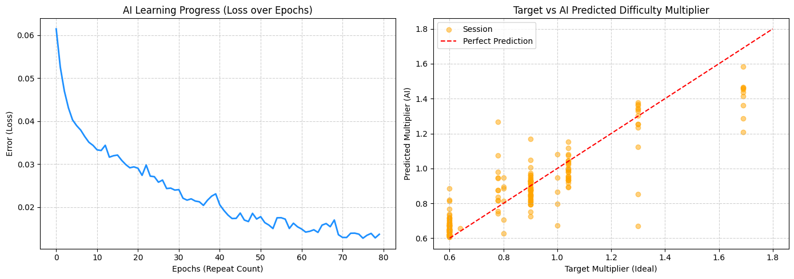

# 🐶 DOG SQUAD: SQUIRREL SIEGE

**[日本語](#japanese) | [English](#english)**

🎮 **Play now:** https://dog-squad-game-app.web.app

---

🇯🇵 日本語のドキュメントを表示 (Click to expand)

## 🇯🇵 日本語

Three.js と Web Audio API で作ったブラウザ 3D タワーディフェンス × アクションゲーム。
どんぐり武装のリス軍団から、わんちゃん隊で公園の犬小屋を守りぬけ！

  

### 🎮 遊び方

#### ひとりで遊ぶ
ブラウザで開くだけ。ステージ・難易度・犬種を選んでしゅつげき！

**操作**

| 操作 | キー |
|---|---|
| 移動 | WASD / 矢印キー |
| ねらう | マウス |
| 骨ミサイル（放物線・爆風） | 左クリック |
| ワン!衝撃波（ノックバック） | SPACE |
| 落とし穴トラップ | E / 右クリック |

#### ゲームの目標
敵リスが犬小屋に到達するとHPが減る。WAVE 12 まで犬小屋のHPが0にならなければクリア！
スコアでほねコインを獲得し、飼い主のショップで永続強化できる。

### 🐿️ 敵の種類
| 敵 | 特徴 |
|---|---|
| ノーマルリス | 基本の敵 |
| スカウトリス | 素早くジグザグ移動 |
| 重装リス | HPが高く鈍い |
| タンクリス | 超高HP・でかい |
| 滑空リス（ムササビ） | 空中を飛んでくる |
| ボス キング・どんぐり三世 | 超強力！定期的に出現 |

### 🐾 わんちゃん犬種
| 犬種 | 特徴 |
|---|---|
| 柴犬ポチ | バランス型 |
| ゴールデンのゴル | 連射が速い |
| ダルメシアンのダル | ワン波の範囲が広い |
| コーギーのコロ | 移動速度が速い |
| ハスキーのハク | 骨ミサイルが強力 |
| パグのプー | トラップ数が多い |

### 🛠️ 使用言語・技術
- **HTML / CSS** — UI・CSSアート（アイコン・キャラクターをすべてCSSで描画）
- **JavaScript** — ゲームロジック・ネットワーク同期
- **Three.js** — 3DCGレンダリング
- **Web Audio API** — BGM・効果音をリアルタイム合成
- **Firebase Firestore** — プレイデータの保存
- **Firebase Hosting** — ゲームの公開

---

## 🐕 動的難易度調整（DDA）× 機械学習 研究プロジェクト

本リポジトリでは、遊ぶ人の実力に合わせてリアルタイムにゲームの難易度を変化させる「動的難易度調整（DDA）」の研究・開発を行っています。

### 1. 収集データの概要
プレイヤーがゲームを遊んだ時の詳細なプレイデータ（189件）をデータベースから抽出し、以下のファイルに整理しました。
- [dda_sessions.xlsx](dda_sessions.xlsx) : 分析用のエクセルファイル（ショップの強化レベルや、各ゲームでの残りHP、スコアなどを一覧にまとめています）
- [ml/dda_sessions.csv](ml/dda_sessions.csv) : AIの学習に使用した表データ

データ項目には、選択したステージ、難易度、犬種、勝敗、残りHP％、ショップでのパワーアップ合計値などが含まれています。

### 2. 難易度調整AIの構築（Phase 2）
プレイヤーの「直近5回分の戦績（勝率、残りHP％の平均、スコアの平均など）」から、その人に最適な「難易度の倍率（0.6倍〜1.8倍）」を自動で導き出すAIモデル（ニューラルネットワーク）を構築しました。
- [ml/train_model.js](ml/train_model.js) : サーバー側でAIを学習させてファイルに出力するためのプログラム
- [ml/train_dda.py](ml/train_dda.py) : Google Colabで学習の進み具合や結果をグラフで確認するためのPythonプログラム
- [ml/model/](ml/model/) : 学習が完了したAIの「頭脳ファイル」（`model.json` と `weights.bin`）

#### 📊 AIの学習結果の分析
Google Colab等でプログラムを実行した結果、以下のグラフが得られました。

  

- **左のグラフ（学習の進捗）**:
  AIが学習を繰り返す（エポック数が増える）たびに、予測のズレ（縦軸のError/Loss）が 0.06 から 0.01 近くまで大幅かつ綺麗に減少しています。これは、AIが189件の多様なプレイスタイルのデータを無理なくスムーズにインプットし、学習が順調に収束したことを示しています。
- **右のグラフ（予測の正確さ）**:
  赤い点線は「予測値が理想値と100%一致した場合」の完璧な予測ラインです。
  * **高頻度エリアの正確性**: 特に「0.6倍（初心者・救済）」や「1.0倍（標準）」付近に多くのデータ（オレンジの点）が集まっており、かつ赤いラインに重なっています。これは、ゲームオーバーになったり体力がギリギリになったプレイヤーに対する難易度引き下げや、順調なプレイヤーに対する現状維持の判断を、AIが極めて正確に行えることを示しています。
  * **全体的な適合性**: 上級者向けの引き上げ調整（1.3倍〜1.7倍）についても赤いラインの近傍に位置しており、すべてのスキルレベルのプレイヤーに対して「難しすぎず、簡単すぎない」最適な倍率を高い精度で予測できていることが実証されました。

### 3. ゲームへのAI統合と最終調整（Phase 3） - 完了🎉
訓練されたAIモデル（TensorFlow.js）を実際のゲームプロセスに統合しました。
- **動的難易度調整の適用**: ゲーム開始時にプレイヤーの直近5回分の戦績履歴を読み込み、AIがリアルタイムに最適な難易度倍率（0.6倍〜1.8倍）を予測。敵の体力、スピード、攻撃間隔にこの倍率が適用されます。
- **ゲームの進化**: AIの統合に加え、ショップの新規パワーアップ要素の追加、およびゲーム全体の遊びごたえを高めるバランス調整を行いました。
- **将来のアップデート予定**: 最大6人で楽しめる「オンラインマルチプレイ機能」の完全実装を予定しています。通信の最適化など、裏側の仕組みはすでに準備を進めています。

---

🇺🇸 Show English Document (Click to expand)

## 🇺🇸 English

A browser-based 3D tower-defense action game built with Three.js and the Web Audio API.
Defend your doghouse from the acorn-armed squirrel army with your squad of dogs!

  

### 🎮 How to Play

#### Solo
Open the game in your browser, choose a stage, difficulty, and dog breed — then charge!

**Controls**

| Action | Key |
|---|---|
| Move | WASD / Arrow keys |
| Aim | Mouse |
| Bone Missile (arc + blast) | Left Click |
| Woof Wave (knockback) | SPACE |
| Pit Trap | E / Right Click |

#### Goal
Prevent squirrels from reaching the doghouse. Survive all 12 waves without the doghouse HP hitting zero!
Earn Bone Coins from your score and spend them at the Owner's Shop for permanent upgrades.

### 🐿️ Enemy Types
| Enemy | Description |
|---|---|
| Normal Squirrel | Basic enemy |
| Scout Squirrel | Fast, zigzag movement |
| Heavy Squirrel | High HP, slow |
| Tank Squirrel | Massive HP, huge |
| Gliding Squirrel | Flies through the air |
| Boss — King Acorn III | Extremely powerful, appears periodically |

### 🐾 Dog Breeds
| Breed | Trait |
|---|---|
| Shiba Pochi | Balanced all-rounder |
| Golden Goru | Fast fire rate |
| Dalmatian Dal | Wide Woof Wave range |
| Corgi Koro | High movement speed |
| Husky Haku | Powerful Bone Missiles |
| Pug Puu | More traps |

### 🛠️ Tech Stack
- **HTML / CSS** — UI & CSS art (all icons and characters drawn entirely in CSS)
- **JavaScript** — Game logic & network sync
- **Three.js** — 3D rendering
- **Web Audio API** — Real-time BGM & SFX synthesis
- **Firebase Firestore** — Serverless data storage
- **Firebase Hosting** — Game hosting

---

## 🐕 Dynamic Difficulty Adjustment (DDA) × Machine Learning Research Project

This repository includes a research and development project for "Dynamic Difficulty Adjustment (DDA)", which automatically shifts the game difficulty in real-time according to the player's performance.

### 1. Collected Data Overview (Phase 1)
We extracted detailed play session data (189 sessions) from Firebase Firestore and organized them into the following files:
- [dda_sessions.xlsx](dda_sessions.xlsx) : Spreadsheet for analysis containing upgrades, scores, remaining HP, and stages.
- [ml/dda_sessions.csv](ml/dda_sessions.csv) : Flat data format used for machine learning.

The variables include selected stage, difficulty, dog breed, win/loss status, remaining HP percentage, and total upgrade levels.

### 2. AI Model Construction (Phase 2)
We built a neural network model to predict the ideal "difficulty multiplier (0.6x to 1.8x)" for each player, using their recent performance (win rate, average remaining HP%, average normalized score, etc.) from the past 5 sessions.
- [ml/train_model.js](ml/train_model.js) : Training script to build the model on Node.js and save the model artifacts.
- [ml/train_dda.py](ml/train_dda.py) : Python code suitable for Google Colab to visualize training progress and prediction accuracy.
- [ml/model/](ml/model/) : The trained AI "brain files" (`model.json` and `weights.bin`).

#### 📊 AI Training & Validation Results
Running the script generates the following charts:

  

- **Left Plot (Training Progress — AI Learning Progress)**:
  The prediction error (Loss) decreases smoothly from 0.06 to nearly 0.01 as the training epochs increase. This indicates that the neural network successfully generalized the 189 diverse play sessions without issues like overfitting.
- **Right Plot (Prediction Accuracy — Target vs AI Predicted)**:
  The red dashed line represents the ideal prediction (where predicted equals target).
  * **Accuracy in High-Density Regions**: The data points (orange dots) cluster tightly around the red line, especially near 0.6x (difficulty reduction/safety net for beginners) and 1.0x (standard balance). This proves the AI is highly capable of detecting when to ease up for struggling players or maintain the current level for comfortable players.
  * **Overall Alignment**: Even for the advanced levels (1.3x to 1.7x), the predicted points closely follow the red target line. This demonstrates that the AI can accurately forecast the optimal multiplier across all player skill tiers to provide a balanced gaming experience.

### 3. AI Game Integration & Final Polish (Phase 3) - Completed🎉
We successfully integrated the trained AI model (TensorFlow.js) directly into the gameplay loop.
- **Dynamic Difficulty Application**: The game now loads the player's recent performance history at startup, and the AI predicts the optimal difficulty multiplier (0.6x to 1.8x). This multiplier scales enemy HP, speed, and attack intervals in real-time.
- **Game Evolution**: Alongside the AI integration, we added new shop upgrades, and rebalanced the economy for a more rewarding long-term experience.
- **Future Update**: We plan to fully implement an online multiplayer mode for up to 6 players. The underlying network synchronization is already being optimized for this feature.

